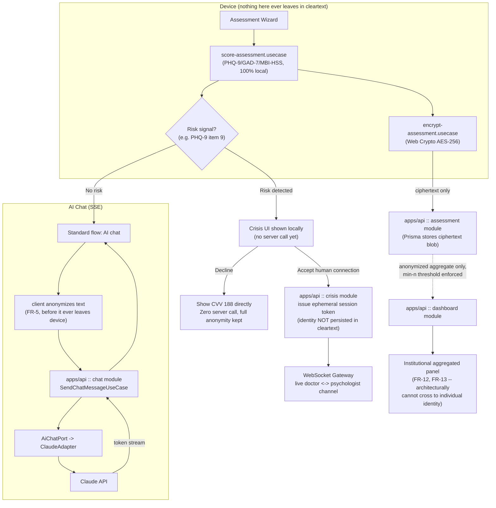

# Zelo — PWA Architecture Design

## Context

This spec defines the technical architecture foundation for Zelo (working name), the mobile-first PWA described in `general-documentations/documentacao-produto/prd.md`. It covers Mauricio's scope from `general-documentations/roadmap/mauricio.md`: monorepo structure, Clean Architecture layering for both frontend and backend, the AI chat provider abstraction, and the local Docker environment.

It does **not** re-derive product requirements — see `general-documentations/documentacao-produto/prd.md` for the full FR list and `general-documentations/documentacao-produto/user-stories.md` for acceptance criteria. This document exists to answer: *given those requirements, how is the code structured so that privacy-by-design is enforced architecturally (not just by policy), and so an AI provider swap is a one-file change?*

Two constraints shaped every decision below:
- **Privacy-by-design is non-negotiable** (PRD FR-1, FR-2, FR-13, FR-14): assessment scores are computed on-device and the server must never be *able* to receive raw answers or cross aggregated metrics back to an individual — this has to be true because the code makes it impossible, not because everyone remembers to redact.
- **28-day hackathon timeline** (roadmap Semana 1–3): every tooling choice below favors low setup cost and a small team over long-term scale, while remaining honest Clean Architecture (not a shortcut that has to be undone later).

## Decisions

| Decision | Choice | Rationale |
|---|---|---|
| Monorepo tool | pnpm workspaces + Turborepo | Task caching/pipeline graph without Nx's generator/tag overhead |
| Shared FE/BE package | `packages/domain` — types + Zod schemas only | Keeps entity shapes in sync without coupling business logic or deploys |
| AI chat architecture | Backend Port/Adapter (`AiChatPort` + `ClaudeAdapter`) | API keys and guardrails stay server-side; provider swap = new adapter class |
| Local datastore | Postgres via Docker Compose | Matches likely production shape; realistic concurrent-write behavior for the demo |
| ORM | Prisma | Type-safety, migrations, Studio for demo-day data inspection; wraps cleanly behind repository interfaces |
| Boundary enforcement | dependency-cruiser lint rules | Catches layer violations automatically; cheap one-time setup |
| Real-time transport | SSE for AI chat, WebSocket (Nest Gateway) for crisis channel | AI chat is one-directional streaming; crisis channel is bidirectional live human chat |
| Frontend framework | Vite + `vite-plugin-pwa` (no Next.js) | No SSR need; SSR would work against client-side-only sensitive computation; simpler mental model |

## Section A — Monorepo Layout

```
zelo/
├── apps/
│   ├── web/                    # React + Vite PWA (frontend)
│   └── api/                    # NestJS backend
├── packages/
│   ├── domain/                 # Shared entities + Zod schemas + TS types ONLY
│   │                           #   (Assessment, RiskSignal, ConsentRecord, CrisisSession, ChatMessage)
│   ├── config/                 # Shared tsconfig, eslint, prettier base configs
│   └── eslint-boundaries/      # dependency-cruiser config — layer-enforcement rules
├── docker/
│   ├── docker-compose.yml      # postgres + api + web, for local prod-parity
│   ├── api.Dockerfile
│   └── web.Dockerfile
├── turbo.json
├── pnpm-workspace.yaml
└── package.json
```

`apps/*` are the only deployable units — they depend on `packages/*`, never the reverse. `packages/domain` holds only types and validation schemas (no business logic), so it can't accidentally pull in Prisma or React. Turborepo pipelines (`build`, `lint`, `test`, `dev`) are defined once in `turbo.json`; each app/package opts in via its own `package.json` scripts, giving correct build order (`domain` builds before `web`/`api` consume it) and caching.

## Section B — Frontend Clean Architecture (`apps/web`)

```
apps/web/src/
├── domain/            # re-exports from packages/domain + any FE-only value objects
├── use-cases/         # framework-agnostic application logic, one class/fn per use case
│   ├── score-assessment.usecase.ts        # PHQ-9/GAD-7/MBI-HSS scoring, pure function
│   ├── encrypt-assessment.usecase.ts       # calls EncryptionPort before any network call
│   ├── send-chat-message.usecase.ts
│   └── request-human-handoff.usecase.ts    # FR-6b shortcut
├── ports/              # interfaces the use-cases depend on (no implementation here)
│   ├── assessment-repository.port.ts       # local persistence contract
│   ├── chat-gateway.port.ts                 # SSE contract
│   ├── encryption.port.ts                   # Web Crypto contract
│   └── consent-store.port.ts
├── infrastructure/      # concrete adapters implementing the ports above
│   ├── http/            # fetch/SSE clients talking to apps/api
│   ├── storage/          # IndexedDB adapter (offline-first assessment progress)
│   └── crypto/           # Web Crypto API (AES-256) adapter
├── stores/              # Zustand — UI-only state (wizard step, modal open/closed, consent flags in-flight)
├── presentation/
│   ├── pages/            # route components (TanStack Router)
│   ├── components/
│   └── hooks/            # e.g. useSendChatMessage() — wraps a use-case in TanStack Query's useMutation/useQuery
└── app/                  # bootstrap: router setup, DI wiring (which adapter implements which port), providers
```

**Dependency rule:** `presentation → hooks → use-cases → ports`, and `infrastructure → implements → ports`. Use-cases never import React, fetch, or IndexedDB directly — they only see port interfaces, so they're unit-testable with in-memory fakes and swappable without touching business logic.

**Where each library sits:**
- **TanStack Query** lives only in `presentation/hooks` — the caching/loading-state wrapper *around* a use-case call, never a place where business logic happens.
- **Zustand** is strictly UI/ephemeral state (wizard progress, "is the crisis modal open") — never a duplicate of server data, so there's one source of truth per concern.
- **TanStack Router** lives in `app/` for route definitions and code-splitting per page.
- **Zod** validates at the two boundaries that matter: form input before it enters a use-case, and any payload crossing `infrastructure/http` (parsed against schemas from `packages/domain`) before it's trusted as a domain object.

## Section C — Backend Clean Architecture (`apps/api`, NestJS)

```
apps/api/src/
├── modules/
│   ├── assessment/
│   │   ├── application/
│   │   │   ├── ports/                # e.g. assessment-repository.port.ts
│   │   │   └── use-cases/            # store-encrypted-assessment.use-case.ts
│   │   ├── infrastructure/
│   │   │   ├── persistence/          # prisma-assessment.repository.ts (implements the port)
│   │   │   └── assessment.controller.ts
│   │   └── assessment.module.ts       # binds port token -> Prisma implementation
│   ├── chat/                          # see Section D
│   ├── crisis/                        # ephemeral token issuance + WebSocket gateway (FR-8, FR-9)
│   ├── peer-matching/
│   ├── consent/                       # FR-15, backs US-007
│   └── dashboard/                     # aggregated metrics, enforces min-n threshold (FR-13)
├── shared/
│   ├── prisma/                        # PrismaService, single connection, injected everywhere
│   └── interceptors/                  # e.g. a logging interceptor that structurally can't log raw payload bodies
└── main.ts
```

**Pattern per module:** `application/ports` defines interfaces (`AssessmentRepository`, `AiChatPort`, etc.); `infrastructure` provides concrete implementations (Prisma repositories, the Claude adapter, WebSocket gateways). NestJS's DI container is the Dependency Inversion mechanism — each module's `*.module.ts` binds a port token to a concrete class:

```ts
providers: [
  { provide: ASSESSMENT_REPOSITORY, useClass: PrismaAssessmentRepository },
]
```

Use-cases and controllers only ever inject the token, never the Prisma class directly — `application/` never imports `infrastructure/` or `@prisma/client`, which is the rule Section F's lint boundaries enforce.

**Privacy enforcement lives here, not just as policy:** the `assessment` module's controller only accepts a `CiphertextPayload` shape (validated against a Zod schema from `packages/domain`) — there is no code path in the backend that can receive a raw PHQ-9/GAD-7 answer, because no DTO for that shape exists. That is FR-2 and FR-13 enforced by architecture, matching the PRD's explicit requirement ("impedir, por arquitetura, não apenas por política").

## Section D — AI Provider Abstraction (Chat Module)

Ports & Adapters (Hexagonal) slice inside the `chat` module — this is the piece that keeps a future provider swap to a single new file.

**The port** (`application/ports/ai-chat.port.ts`) — the only thing the rest of the app knows about:
```ts
export interface AiChatPort {
  streamReply(params: {
    conversationId: string;
    anonymizedMessages: AnonymizedMessage[];  // already scrubbed client-side per FR-5
    systemPrompt: string;                     // guardrails against diagnosis, FR-4
  }): AsyncIterable<ChatToken>;
}
export const AI_CHAT_PORT = Symbol('AI_CHAT_PORT');
```

**The adapter** (`infrastructure/ai-providers/claude.adapter.ts`) implements it using the Anthropic SDK's streaming `messages` API (model configurable via env, e.g. `claude-sonnet-5`), mapping Claude's stream events into the generic `ChatToken` shape the port defines.

**Swapping providers later** means writing a new adapter (e.g. `openai.adapter.ts`) implementing the same `AiChatPort`, then changing one factory binding in `chat.module.ts`:
```ts
{
  provide: AI_CHAT_PORT,
  useFactory: (config: ConfigService) =>
    config.get('AI_PROVIDER') === 'claude'
      ? new ClaudeAdapter(config)
      : new OpenAiAdapter(config),
  inject: [ConfigService],
}
```
Nothing in `SendChatMessageUseCase`, the controller, or the frontend ever changes — they only depend on `AI_CHAT_PORT`.

**Where guardrails and the FR-6b human-shortcut logic live:** `SendChatMessageUseCase` (not the adapter) injects the system prompt, calls `AiChatPort.streamReply`, and — per the PRD's documented edge case — catches provider failures. If the provider errors *and* a risk signal is already flagged for the session, the use-case routes straight to the crisis flow instead of surfacing a generic "AI unavailable" message. The "talk to a human" shortcut (FR-6b) is a separate, always-available use-case (`RequestHumanHandoffUseCase`) that does not go through the AI port at all, by design, since it must work even if the AI provider is down.

## Section E — Docker Compose Local Environment

Purpose: run actual production builds locally (not `pnpm dev`) to catch build-only problems before the live demo.

```
docker/
├── docker-compose.yml
├── api.Dockerfile      # multi-stage: pnpm install --frozen-lockfile -> turbo build --filter=api -> node dist/src/main.js
└── web.Dockerfile      # multi-stage: turbo build --filter=web -> serve static dist/ via nginx
```

```yaml
services:
  postgres:
    image: postgres:16-alpine
    environment: [POSTGRES_DB=zelo, POSTGRES_USER=zelo, POSTGRES_PASSWORD=...]
    volumes: [pgdata:/var/lib/postgresql/data]
    healthcheck: pg_isready

  api:
    build: { context: .., dockerfile: docker/api.Dockerfile }
    env_file: .env.docker         # AI_PROVIDER, ANTHROPIC_API_KEY, DATABASE_URL, etc.
    depends_on: { postgres: { condition: service_healthy } }
    ports: ["3000:3000"]

  web:
    build: { context: .., dockerfile: docker/web.Dockerfile }
    depends_on: [api]
    ports: ["8080:80"]

volumes:
  pgdata:
```

`api.Dockerfile` runs `prisma migrate deploy` against the `postgres` service on container start, so `docker compose up` gives a fully migrated DB every time. Secrets (`ANTHROPIC_API_KEY`) come from a gitignored `.env.docker`, never baked into the image. This is local-only prod-parity, not the real deploy pipeline — that stays Gui's domain per `general-documentations/roadmap/gui.md` — but the same Dockerfiles are the natural starting point for whatever he builds there.

## Section F — Boundary Enforcement + Testing Strategy

**Boundary enforcement:** `dependency-cruiser` (config in `packages/config`, applied per app), e.g.:
```js
{
  name: 'no-infra-in-application',
  from: { path: '^src/(use-cases|application)' },
  to:   { path: '(infrastructure|node_modules/(react|@nestjs|@prisma))' },
  severity: 'error',
}
```
Paths are relative to each app's own `src/`, not prefixed with `apps/web/` or `apps/api/` — `depcruise` runs with cwd set to the package/app directory (via `pnpm --filter`/`turbo run`), so it reports and matches module paths relative to that cwd (verified during implementation — see Plan 01 Task 6). Same idea for `domain` (must import nothing from either app) and for presentation not reaching past hooks into raw infrastructure. Wired into `turbo.json` as a `lint:boundaries` task so it runs inside `turbo run lint` — the same command everyone already runs — and fails CI the same way a type error would.

**Testing strategy** (Vitest everywhere — fast, ESM-native, works for both the Vite frontend and the Nest backend):

| Layer | Approach | Priority |
|---|---|---|
| `domain` + `use-cases` (both apps) | Pure unit tests, in-memory fake port implementations | **Highest** — privacy correctness lives here (score never leaks raw, anonymization enforced, min-n threshold, crisis fallback-on-AI-failure) |
| Adapters (Prisma repos, `ClaudeAdapter`) | Integration tests against dockerized Postgres; a shared "port contract" suite every `AiChatPort` implementation must pass | Medium |
| Frontend components | Vitest + React Testing Library on the assessment wizard and chat UI | Medium |
| End-to-end | One Playwright "golden path" smoke test: assessment → score → chat → crisis accept/decline | Low effort, high demo-confidence |

Given the 3-week window, unit tests on `use-cases` are non-negotiable — they're what proves to checkpoint reviewers that privacy rules are enforced in code, not just policy. Everything else in the table is time-permitting.

## Section G — End-to-End Data Flow / Privacy Architecture



The property this buys: the server *never sees* a risk signal exists unless the user explicitly opts into the accept path — detection and the decision to show the crisis UI are 100% client-side. A decline never touches the network. This is a stronger claim than "we encrypt data in transit" — it's "the server structurally cannot know," which is what FR-13 requires, and is a concrete, demonstrable answer for the checkpoint reviewers and the checklist's mandatory privacy-architecture diagram (owned by Gui, this doc is the source material).

## Implementation Roadmap

This architecture is implemented as six plans, each scoped to run as its own Claude Code session:

| # | Plan | Scope | Depends on |
|---|---|---|---|
| 01 | Monorepo Foundation | pnpm workspace, Turborepo, `packages/domain`, `packages/config`, dependency-cruiser rules | — |
| 02 | Backend Foundation | NestJS skeleton in `apps/api`, Prisma + Postgres wiring, module folder convention, one smoke-test module | 01 |
| 03 | Frontend Foundation | Vite + `vite-plugin-pwa`, TanStack Router base routes, Tailwind, Zustand scaffold, clean-arch folders | 01 |
| 04 | Docker Local Env | docker-compose (Postgres + api + web), Dockerfiles, `.env.docker`, migrate-on-start | 02, 03 |
| 05 | AI Chat Vertical | `AiChatPort` + `ClaudeAdapter`, SSE chat module, frontend chat use-cases/hooks/UI, FR-6b handoff shortcut | 04 |
| 06 | Assessment Vertical | PHQ-9/GAD-7/MBI-HSS forms, client-side scoring, Web Crypto encryption, IndexedDB, backend ciphertext endpoint | 04 |

Plans 05 and 06 are the two Week-1 PRD priorities (roadmap `Semana 1`) and can run in parallel once 01–04 are complete; 02 and 03 can also run in parallel with each other. Week-2/3 features (crisis escalation build-out, peer matching, dashboard) are intentionally **not** planned yet — the PRD lists open dependencies there (clinical risk criteria, confirmed vs. simulated psychologist partner) that would make those plans speculative today. The crisis module's shape is already established in Section C and Section G, so its plan will be fast to write once those dependencies resolve.

## Open Questions (carried from PRD, architecture-relevant)

- Final LLM provider and its data-retention policy (PRD "Perguntas em Aberto") — architecture supports any provider via `AiChatPort`, so this does not block Plans 01–04, only the concrete adapter choice in Plan 05.
- Minimum-n threshold for the dashboard's aggregation guard (FR-13) — needed before Plan 06 wires the dashboard's threshold check; owned by Mauricio + PM per PRD.
- Exact clinical criteria for "risk agudo" beyond PHQ-9 item 9 — needed before the crisis module's detection logic is finalized (post Plan 06, pending clinical partner).
