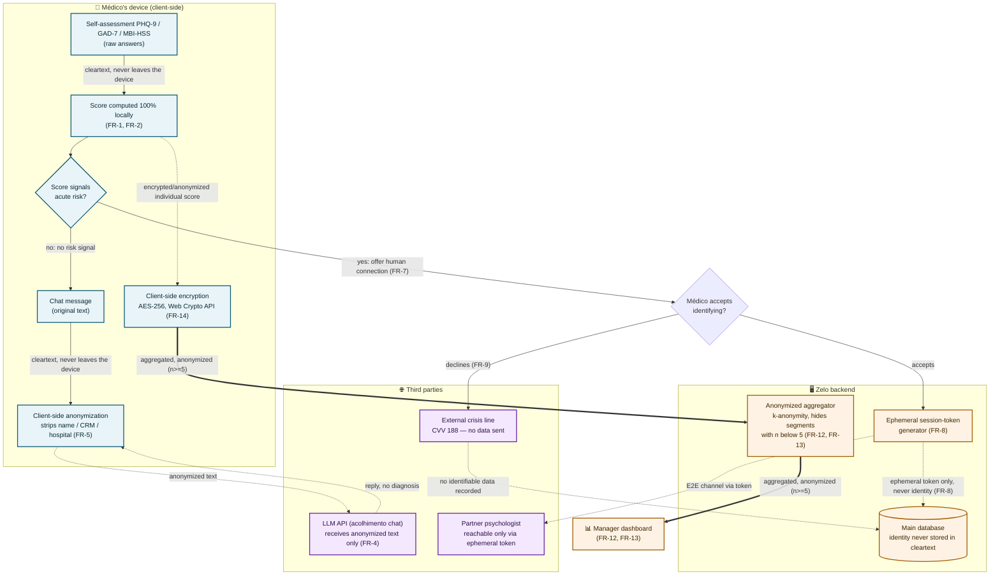

# Privacy Architecture — Data Flow Diagram

**Status:** mandatory challenge-checklist deliverable ("Documentação da arquitetura de
privacidade, com diagrama de fluxo de dados"). Owner: Mauricio (absorbed from Gui's DevOps
scope after Gui left the team on 2026-07-11; see `general-documentations/roadmap/README.md`).
Due: Checkpoint 3, 2026-07-18.

**Purpose:** make the product's central trust claim ("processado no seu aparelho", "ninguém
do hospital vê quem você é") verifiable at a glance, not just asserted in copy
(`docs/superpowers/specs/screens/02-privacy.md`). Audience: the Jornada's evaluation board and
any future hospital/cooperativa buyer who asks "how do I know this is true."

## Planning worksheet

- **What relationship/flow needs to be visible:** which data crosses the device boundary, in
  what form (cleartext / encrypted-anonymized-individual / aggregated), and the two crisis
  branches (accept identification vs. decline and stay anonymous).
- **Cardinal-rule check:** yes — this has real branching (crisis accept/decline) and a
  boundary-crossing relationship (device vs. server vs. third party) that a list would flatten.
  A flowchart is the right type (decision points + multi-party data flow).
- **Node inventory:** device-side (assessment, local score, chat message, anonymization,
  encryption, risk-signal decision), server-side (aggregator/k-anonymity gate, ephemeral-token
  generator, main database), third parties (LLM provider, partner psychologist, external crisis
  line), plus the manager dashboard as the terminal aggregated-data consumer.
- **Type rationale:** Flowchart (TD) over Sequence, because the point is *what crosses which
  boundary in what form*, not strict message ordering between named actors.

## Diagram

Edge-style legend (style + label together — color is never the only signal):

- **Solid `-->`** = cleartext, never leaves the device.
- **Dotted `-.->`** = encrypted/anonymized, individual-level data crossing a boundary.
- **Thick `==>`** = aggregated, anonymized data (k-anonymity, k≥5) crossing a boundary.

## What this diagram is evidence of

| Claim made in `02-privacy.md` copy | Where it's proven above |
|---|---|
| "Processado no seu aparelho" | `A -- cleartext --> B`: the score is computed before any edge leaves the `DEV` subgraph. |
| "Ninguém do hospital vê quem você é — nem o seu CRM" | Every edge crossing into `SRV`/`EXT` is dotted (anonymized/encrypted) or thick (aggregated) — no solid (cleartext) edge ever crosses a subgraph boundary. |
| "Nada é compartilhado sem o seu aceite explícito" | The only edge that reaches a named human (`K`, the partner psychologist) is gated behind the `N` decision node's "accepts" branch. |
| k-anonymity floor (`13-manager.md`, `n >= 5`) | `G`'s label states the suppression rule explicitly; `M` (manager dashboard) only ever receives `G`'s output, never `F`'s individual-level data directly. |

## Known simplifications (declare these to the board, don't hide them)

- The diagram shows the target architecture from the PRD (FR-1 through FR-14). Where the current
  build still has `// TODO` placeholders (see `identity-and-aggregation.md` for `Peers`/`Manager`
  specifically), say so live rather than letting the diagram imply it's all already wired.
- The LLM provider box (`J`) is generic by design — the PRD still lists "Escolha final do
  provedor de LLM" as an open dependency. If that gets locked (see the team's action-plan P5),
  update this label with the real provider name.
- The partner-psychologist path (`K`) may be simulated for the live demo if no real partner is
  confirmed by the checkpoint — the PRD already anticipates this (`prd.md`, Dependências). The
  diagram documents the intended architecture either way; the demo script should say explicitly
  which parts are live vs. simulated.

## Validation checklist

- [x] Renders without error (verified in mermaid.live).
- [x] Cardinal rule satisfied — branching (accept/decline) and boundary-crossing relationships a list would flatten.
- [x] All labels with spaces/parentheses/colons are quoted.
- [x] No unescaped `<`/`>`/`#` outside of ` ` line breaks.
- [x] Node count (14) within flowchart readability range, grouped into 3 subgraphs.
- [x] Color is not the only differentiator — subgraph grouping, node shape (process / decision `{}` / database `[()]`), and edge style (solid/dotted/thick) all carry meaning independently of color.
- [x] Title and surrounding prose context present (this file).
